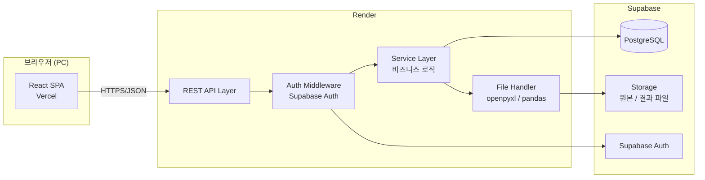
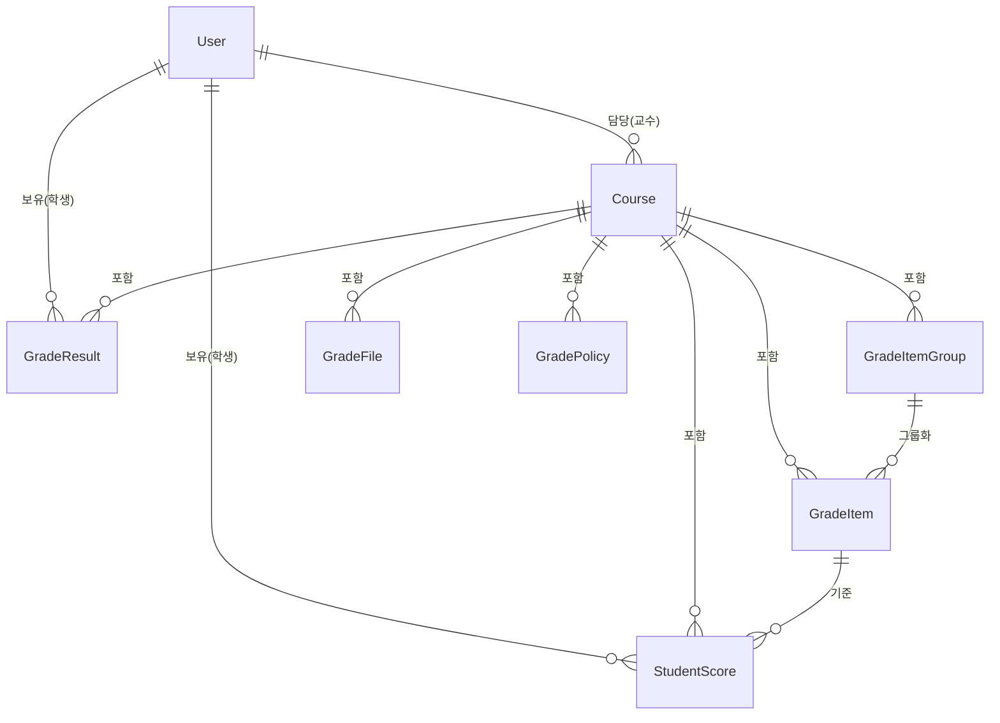
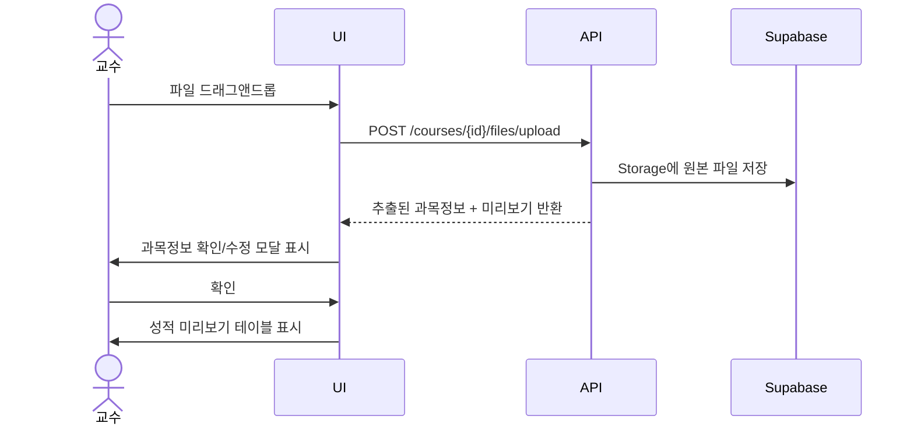
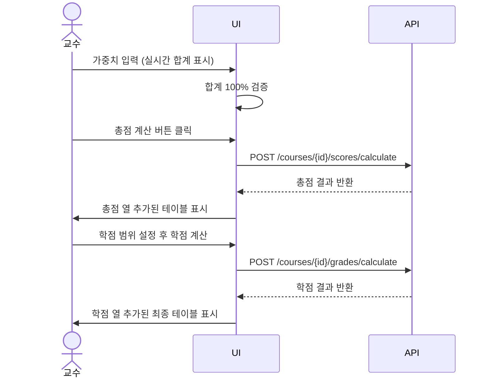

# Tech Spec: SmartGrader

---

## 1. 문서 정보

| 항목 | 내용 |
|------|------|
| **작성일** | 2026-03-13 |
| **상태** | Draft |
| **버전** | v0.1 |
| **원문 PRD** | smartgrader-prd.md |

---

## 2. 시스템 아키텍처

### 2-1. 아키텍처 패턴

| 패턴 | 선택 이유 |
|------|-----------|
| MVC 기반 모놀리식 풀스택 | 동시 접속 50명 규모에서 MSA는 불필요한 복잡도. 단일 서버에서 API·파일 처리·DB를 담당하여 유지보수와 교육적 이해가 쉬움 |

### 2-2. 컴포넌트 구성도



### 2-3. 배포 환경

| 환경 | 호스팅 | 무료 플랜 제한 | 비고 |
|------|--------|---------------|------|
| Frontend | **Vercel** | 무제한 | React 빌드 자동 배포 |
| Backend | **Render** | 월 750시간, 비활성 15분 후 슬립 | FastAPI / uvicorn |
| Database | **Supabase** | 500MB, 50,000 MAU | PostgreSQL |
| 파일 스토리지 | **Supabase Storage** | 1GB | 원본·결과 파일 저장 |
| CI/CD | **GitHub Actions** | 월 2,000분 | lint → test → deploy |

> ⚠️ Render 무료 플랜은 비활성 상태에서 15분 후 슬립됩니다. 첫 요청 시 30초 내외 대기가 발생할 수 있으며, UI에서 "서버를 깨우는 중이에요..." 안내를 표시합니다.

---

## 3. 기술 스택

| 분류 | 기술 | 버전 | 선정 이유 |
|------|------|------|-----------|
| **Frontend** | React | 18.x | 컴포넌트 기반 UI, 생태계 풍부 |
| | Vite | 5.x | 빠른 개발 서버 및 빌드 |
| | TailwindCSS | 3.x | 유틸리티 클래스로 빠른 UI 구성 |
| | React Router | 6.x | 역할별 라우팅 (관리자/교수/학생) |
| | Zustand | 4.x | 전역 상태 관리 (인증 상태, 과목 선택 등) |
| | @supabase/supabase-js | 2.x | Supabase Auth + DB + Storage 연동 |
| **Backend** | Python | 3.11 | 파일 파싱·계산 로직에 최적 |
| | FastAPI | 0.11x | 빠른 REST API 개발, 자동 문서화(Swagger) |
| | pandas | 2.x | .xlsx/.xls/.csv 파싱 및 데이터 처리 |
| | openpyxl | 3.x | 엑셀 파일 생성 (결과 파일 다운로드) |
| | supabase-py | 2.x | Supabase DB·Storage Python SDK |
| **Database** | Supabase (PostgreSQL) | 15.x | 관계형 DB, 무료 플랜으로 실운영 가능 |
| **파일 스토리지** | Supabase Storage | - | 원본·결과 파일 저장, 1GB 무료 |
| **인증** | Supabase Auth | - | 세션 관리·역할 구분, JWT 추상화 |
| **배포** | Vercel (Frontend) | - | GitHub 연동 자동 배포 |
| | Render (Backend) | - | FastAPI 컨테이너 배포, 무료 750시간/월 |
| **CI/CD** | GitHub Actions | - | lint → test → Vercel/Render 자동 배포 |

---

## 4. 데이터 모델

### 4-1. 엔티티 정의

#### User (사용자)
| 필드 | 타입 | 설명 |
|------|------|------|
| id | uuid | PK, Supabase Auth UID |
| login_id | varchar | 로그인 ID (관리자: 110509, 학생: 학번) |
| name | varchar | 이름 |
| role | enum | 'admin' / 'professor' / 'student' |
| created_at | timestamp | 생성일 |

#### Course (과목)
| 필드 | 타입 | 설명 |
|------|------|------|
| id | uuid | PK |
| professor_id | uuid | FK → User.id |
| course_name | varchar | 과목명 |
| course_code | varchar | 교과코드 |
| section | varchar | 분반 (없으면 NULL) |
| semester | varchar | 학기 (예: 2026-1) |
| created_at | timestamp | 생성일 |

#### GradeItemGroup (성적 항목 그룹)
| 필드 | 타입 | 설명 |
|------|------|------|
| id | uuid | PK |
| course_id | uuid | FK → Course.id |
| name | varchar | 그룹명 (예: 과제, 프로젝트) |
| weight | numeric | 그룹 가중치 (%) |

#### GradeItem (성적 항목)
| 필드 | 타입 | 설명 |
|------|------|------|
| id | uuid | PK |
| course_id | uuid | FK → Course.id |
| group_id | uuid | FK → GradeItemGroup.id (그룹 소속 시), NULL 허용 |
| name | varchar | 항목명 (예: 중간고사, 과제1) |
| weight | numeric | 가중치 (%) — 그룹 미소속 항목만 설정, 그룹 소속 시 NULL |
| item_type | enum | 'general' / 'attendance' / 'attitude' |
| deduction_per_absence | numeric | 결석 1회당 차감점 (item_type='attendance'일 때) |
| display_order | integer | 표시 순서 |

#### GradeFile (성적 파일)
| 필드 | 타입 | 설명 |
|------|------|------|
| id | uuid | PK |
| course_id | uuid | FK → Course.id |
| file_type | enum | 'original' / 'result' |
| storage_path | varchar | Supabase Storage 경로 |
| uploaded_at | timestamp | 업로드일 |

#### StudentScore (학생 점수)
| 필드 | 타입 | 설명 |
|------|------|------|
| id | uuid | PK |
| course_id | uuid | FK → Course.id |
| student_id | uuid | FK → User.id |
| grade_item_id | uuid | FK → GradeItem.id |
| raw_score | numeric | 원점수 (general / attitude 항목) |
| absence_count | integer | 결석시수 (attendance 항목만, 나머지 NULL) |

#### GradeResult (총점·학점 결과)
| 필드 | 타입 | 설명 |
|------|------|------|
| id | uuid | PK |
| course_id | uuid | FK → Course.id |
| student_id | uuid | FK → User.id |
| total_score | numeric(5,2) | 총점 |
| grade | varchar | 학점 (A+, A0 … F) |
| calculated_at | timestamp | 계산일 |

#### GradePolicy (학점 범위 설정)
| 필드 | 타입 | 설명 |
|------|------|------|
| id | uuid | PK |
| course_id | uuid | FK → Course.id |
| grade | varchar | 학점 (A+, A0 … F) |
| min_score | numeric | 최솟값 |
| max_score | numeric | 최댓값 |

---

### 4-2. ERD



---

## 5. API 명세

### 5-1. 공통 규칙

- Base URL: `https://smartgrader-api.onrender.com/api/v1`
- 인증: 모든 API는 Supabase Auth 세션 토큰을 `Authorization: Bearer {token}` 헤더로 전달
- 공통 응답 형식:

```json
// 성공
{ "success": true, "data": { ... } }

// 실패
{ "success": false, "error": "오류 메시지" }
```

### 보안 정책

| 정책 | 내용 |
|------|------|
| **CORS** | Vercel 배포 도메인만 허용. 그 외 출처의 API 직접 호출 차단 |
| **인증 필수** | 모든 엔드포인트는 Supabase Auth 세션 토큰 필수. 토큰 없는 요청은 401 반환 |
| **RBAC** | 각 엔드포인트는 허용된 role(admin / professor / student)만 접근 가능. 권한 외 접근 시 403 반환 |
| **Supabase RLS** | DB 레벨에서 Row Level Security 정책 적용 — 학생은 본인 학번 데이터만 SELECT 가능 |

---

### 5-2. 인증 (Auth)

| 메서드 | 엔드포인트 | 설명 | 권한 |
|--------|-----------|------|------|
| POST | `/auth/login` | 로그인 | 전체 |
| POST | `/auth/logout` | 로그아웃 | 전체 |
| PATCH | `/auth/password` | 비밀번호 변경 | 전체 |

---

### 5-3. 사용자 관리 (Users)

| 메서드 | 엔드포인트 | 설명 | 권한 |
|--------|-----------|------|------|
| GET | `/users/professors` | 교수 목록 조회 | admin |
| POST | `/users/professors` | 교수 계정 등록 | admin |
| PATCH | `/users/professors/{id}` | 교수 계정 수정 | admin |
| DELETE | `/users/professors/{id}` | 교수 계정 삭제 | admin |

**POST `/users/professors` 요청 예시**
```json
{
  "login_id": "prof001",
  "name": "홍길동",
  "password": "initial1234"
}
```

---

### 5-4. 과목 관리 (Courses)

| 메서드 | 엔드포인트 | 설명 | 권한 |
|--------|-----------|------|------|
| GET | `/courses` | 내 담당 과목 목록 | professor |
| POST | `/courses` | 과목 등록 | professor |
| PATCH | `/courses/{id}` | 과목 정보 수정 | professor |
| DELETE | `/courses/{id}` | 과목 삭제 | professor |

---

### 5-5. 성적 파일 (Grade Files)

| 메서드 | 엔드포인트 | 설명 | 권한 |
|--------|-----------|------|------|
| POST | `/courses/{id}/files/upload` | 성적 파일 업로드 | professor |
| GET | `/courses/{id}/files` | 파일 목록 조회 | professor |
| DELETE | `/courses/{id}/files/{file_id}` | 파일 삭제 | professor |
| GET | `/courses/{id}/files/{file_id}/download` | 파일 다운로드 | professor |

**POST `/courses/{id}/files/upload` 응답 예시**
```json
{
  "success": true,
  "data": {
    "extracted_info": {
      "course_name": "소프트웨어공학",
      "course_code": "CS401",
      "section": "01",
      "semester": "2026-1"
    },
    "preview": [
      { "student_id": "20210001", "name": "김철수", "midterm": 85, "absence_count": 3 }
    ],
    "auto_extracted": true
  }
}
```

---

### 5-6. 성적 항목 & 가중치 (Grade Items)

| 메서드 | 엔드포인트 | 설명 | 권한 |
|--------|-----------|------|------|
| GET | `/courses/{id}/items` | 성적 항목 목록 조회 | professor |
| POST | `/courses/{id}/items` | 항목 추가 | professor |
| PATCH | `/courses/{id}/items/{item_id}` | 항목 수정 | professor |
| DELETE | `/courses/{id}/items/{item_id}` | 항목 삭제 | professor |

**POST `/courses/{id}/items` 요청 예시**
```json
{
  "name": "중간고사",
  "weight": 25,
  "item_type": "general",
  "group_id": null
}
```

---

### 5-7. 성적 항목 그룹 (Grade Item Groups)

| 메서드 | 엔드포인트 | 설명 | 권한 |
|--------|-----------|------|------|
| GET | `/courses/{id}/groups` | 그룹 목록 조회 | professor |
| POST | `/courses/{id}/groups` | 그룹 생성 | professor |
| PATCH | `/courses/{id}/groups/{group_id}` | 그룹명·가중치 수정 | professor |
| DELETE | `/courses/{id}/groups/{group_id}` | 그룹 삭제 | professor |
| PATCH | `/courses/{id}/items/{item_id}/group` | 항목을 그룹에 추가/해제 | professor |

---

### 5-8. 점수 관리 (Scores)

| 메서드 | 엔드포인트 | 설명 | 권한 |
|--------|-----------|------|------|
| GET | `/courses/{id}/scores` | 전체 학생 점수 조회 | professor |
| PATCH | `/courses/{id}/scores` | 점수 수정·저장 | professor |
| POST | `/courses/{id}/scores/calculate` | 총점 계산 | professor |
| POST | `/courses/{id}/grades/calculate` | 학점 계산 | professor |

**POST `/courses/{id}/scores/calculate` 응답 예시**
```json
{
  "success": true,
  "data": {
    "results": [
      { "student_id": "20210001", "name": "김철수", "total_score": 86.00 }
    ]
  }
}
```

---

### 5-9. 학점 정책 (Grade Policy)

| 메서드 | 엔드포인트 | 설명 | 권한 |
|--------|-----------|------|------|
| GET | `/courses/{id}/policy` | 학점 범위 조회 | professor |
| PUT | `/courses/{id}/policy` | 학점 범위 저장 | professor |

**PUT `/courses/{id}/policy` 요청 예시**
```json
{
  "policies": [
    { "grade": "A+", "min_score": 95,  "max_score": 100  },
    { "grade": "A0", "min_score": 90,  "max_score": 94.9 },
    { "grade": "B+", "min_score": 85,  "max_score": 89.9 },
    { "grade": "B0", "min_score": 80,  "max_score": 84.9 },
    { "grade": "C+", "min_score": 75,  "max_score": 79.9 },
    { "grade": "C0", "min_score": 70,  "max_score": 74.9 },
    { "grade": "D+", "min_score": 65,  "max_score": 69.9 },
    { "grade": "D0", "min_score": 60,  "max_score": 64.9 },
    { "grade": "F",  "min_score": 0,   "max_score": 59.9 }
  ]
}
```

---

### 5-10. 학생 성적 조회 (Student)

| 메서드 | 엔드포인트 | 설명 | 권한 |
|--------|-----------|------|------|
| GET | `/student/courses` | 수강 과목 목록 (학기별) | student |
| GET | `/student/courses/{id}/scores` | 과목별 성적 상세 조회 | student |

**GET `/student/courses` 응답 예시**
```json
{
  "success": true,
  "data": {
    "courses": [
      {
        "semester": "2026-1",
        "courses": [
          { "id": "uuid-1", "course_name": "소프트웨어공학", "course_code": "CS401", "section": "01" },
          { "id": "uuid-2", "course_name": "자료구조", "course_code": "CS301", "section": null }
        ]
      }
    ]
  }
}
```

**GET `/student/courses/{id}/scores` 응답 예시**
```json
{
  "success": true,
  "data": {
    "course_name": "소프트웨어공학",
    "semester": "2026-1",
    "items": [
      { "name": "중간고사",  "weight": 25, "raw_score": 80,   "contribution": 20.00 },
      { "name": "기말고사",  "weight": 30, "raw_score": 90,   "contribution": 27.00 },
      { "name": "출석",      "weight": 10, "absence_count": 3, "contribution": 8.50  },
      { "name": "태도",      "weight": 5,  "raw_score": 4,    "contribution": 4.00  },
      { "name": "과제 그룹", "weight": 20, "group_avg": 90.0, "contribution": 18.00 },
      { "name": "프로젝트 그룹", "weight": 10, "group_avg": 85.0, "contribution": 8.50 }
    ],
    "total_score": 86.00,
    "grade": "B+"
  }
}
```

---

## 6. 상세 기능 명세

### 6-1. Frontend 컴포넌트 트리

```
src/
├── main.jsx
├── App.jsx                          # 라우터 루트
├── router/
│   └── PrivateRoute.jsx             # 역할별 접근 제어
├── pages/
│   ├── LoginPage.jsx                # 공통 로그인
│   ├── admin/
│   │   ├── AdminDashboard.jsx       # 관리자 대시보드
│   │   └── ProfessorManagePage.jsx  # 교수 계정 관리
│   ├── professor/
│   │   ├── ProfessorDashboard.jsx   # 교수 대시보드
│   │   ├── CourseListPage.jsx       # 과목 목록
│   │   ├── GradeUploadPage.jsx      # 성적 파일 업로드
│   │   ├── GradeItemPage.jsx        # 성적 항목·가중치·그룹 설정
│   │   ├── GradeManagePage.jsx      # 성적 조회·수정
│   │   ├── GradeCalculatePage.jsx   # 총점·학점 계산
│   │   └── GradePolicyPage.jsx      # 학점 범위 설정
│   └── student/
│       ├── StudentDashboard.jsx     # 학생 대시보드
│       └── StudentGradePage.jsx     # 과목별 성적 조회
└── components/
    ├── common/
    │   ├── Spinner.jsx              # 로딩 스피너
    │   ├── Toast.jsx                # 오류·성공 알림
    │   ├── Modal.jsx                # 공통 모달
    │   └── ConfirmDialog.jsx        # 삭제 확인 다이얼로그
    ├── grade/
    │   ├── GradeTable.jsx           # 성적 데이터 테이블
    │   ├── WeightEditor.jsx         # 가중치·그룹 설정 UI
    │   ├── GradePolicyEditor.jsx    # 학점 범위 설정 UI
    │   └── FileUploader.jsx         # 파일 업로드 드래그앤드롭
    └── layout/
        ├── Header.jsx
        └── Sidebar.jsx
```

---

### 6-2. 라우팅 & 역할별 접근 제어

| 경로 | 컴포넌트 | 접근 권한 |
|------|----------|-----------|
| `/login` | LoginPage | 전체(비인증) |
| `/admin` | AdminDashboard | admin |
| `/admin/professors` | ProfessorManagePage | admin |
| `/professor` | ProfessorDashboard | professor, admin |
| `/professor/courses` | CourseListPage | professor, admin |
| `/professor/courses/:id/upload` | GradeUploadPage | professor, admin |
| `/professor/courses/:id/items` | GradeItemPage | professor, admin |
| `/professor/courses/:id/grades` | GradeManagePage | professor, admin |
| `/professor/courses/:id/calculate` | GradeCalculatePage | professor, admin |
| `/professor/courses/:id/policy` | GradePolicyPage | professor, admin |
| `/student` | StudentDashboard | student |
| `/student/courses/:id` | StudentGradePage | student |

---

### 6-3. 핵심 UI 흐름

#### 교수 — 성적 업로드 흐름


#### 교수 — 총점·학점 계산 흐름


---

### 6-4. Backend 레이어 책임 분리

```
app/
├── main.py                  # FastAPI 앱 초기화, CORS 설정
├── routers/                 # 라우터 (HTTP 요청 수신·응답 반환만)
│   ├── auth.py
│   ├── users.py
│   ├── courses.py
│   ├── grade_items.py
│   ├── scores.py
│   └── student.py
├── services/                # 비즈니스 로직 (계산, 검증)
│   ├── auth_service.py
│   ├── course_service.py
│   ├── grade_service.py     # 총점·학점 계산 핵심 로직
│   ├── file_service.py      # 파일 파싱·생성
│   └── student_service.py
├── repositories/            # DB 접근 (Supabase Python SDK)
│   ├── user_repo.py
│   ├── course_repo.py
│   ├── score_repo.py
│   └── grade_repo.py
├── models/                  # Pydantic 요청·응답 스키마
│   ├── user.py
│   ├── course.py
│   ├── grade.py
│   └── score.py
└── utils/
    ├── file_parser.py       # xlsx/xls/csv → DataFrame 변환
    ├── excel_exporter.py    # 결과 DataFrame → xlsx 생성
    └── grade_calculator.py  # 총점·학점 계산 유틸
```

---

### 6-5. 핵심 비즈니스 로직 (grade_calculator.py)

#### 총점 계산 규칙

| 유형 | 계산 방식 |
|------|-----------|
| general | raw_score × (weight / 100) |
| group | 그룹 내 항목 평균 × (group.weight / 100) |
| attendance | max(0, weight − (0.5 × absence_count)) → 직접 합산 |
| attitude | raw_score → 직접 합산 (범위 검증: 0 ≤ raw_score ≤ weight) |

#### 총점 계산 흐름 (pseudocode)

```python
def calculate_total(student_scores, grade_items, grade_groups):
    total = 0.0

    for item in grade_items:
        if item.group_id is not None:
            continue  # 그룹 항목은 그룹 단위로 처리

        score = get_score(student_scores, item.id)

        if item.item_type == "general":
            total += score.raw_score * (item.weight / 100)

        elif item.item_type == "attendance":
            attendance_score = item.weight - (0.5 * score.absence_count)
            attendance_score = max(0, attendance_score)
            total += attendance_score  # 직접 합산

        elif item.item_type == "attitude":
            total += score.raw_score  # 직접 합산

    for group in grade_groups:
        group_items = [i for i in grade_items if i.group_id == group.id]
        group_scores = [get_score(student_scores, i.id).raw_score for i in group_items]
        group_avg = sum(group_scores) / len(group_scores)
        total += group_avg * (group.weight / 100)

    return round(total, 2)
```

#### 학점 산출

```python
def calculate_grade(total_score, policies):
    for policy in policies:
        if policy.min_score <= total_score <= policy.max_score:
            return policy.grade
    return "F"
```

#### 총점 계산 예시 (검증용)

```
과목: 소프트웨어공학 / 학생: 김철수

항목 구성:
  중간고사    general     25%   원점수: 80
  기말고사    general     30%   원점수: 90
  출석        attendance  10%   결석시수: 3회
  태도        attitude     5%   원점수: 4 (0~5 범위 검증)
  과제 그룹   group       20%   과제1:95, 과제2:85, 과제3:90
  프로젝트 그룹 group     10%   프로젝트1:100, 프로젝트2:70

계산:
  ① 중간고사    → 80  × 0.25 = 20.00점
  ② 기말고사    → 90  × 0.30 = 27.00점
  ③ 출석        → 10 − (0.5 × 3) = 8.5 → 8.50점 (직접 합산)
  ④ 태도        → 4점 (직접 합산)
  ⑤ 과제 그룹  → (95+85+90)/3 = 90.00 × 0.20 = 18.00점
  ⑥ 프로젝트   → (100+70)/2  = 85.00 × 0.10 =  8.50점

  총점 = 20.00 + 27.00 + 8.50 + 4.00 + 18.00 + 8.50 = 86.00점
  학점 = B+  (85.0 ≤ 86.00 ≤ 89.9)
```

---

### 6-6. 성능·보안 고려사항

| 항목 | 내용 |
|------|------|
| 파일 크기 제한 | 업로드 파일 최대 10MB |
| CORS | Vercel 배포 도메인만 허용 |
| Supabase RLS | student role은 본인 student_id 행만 SELECT 가능 |
| 점수 정밀도 | numeric(5,2) — 소수점 2자리까지 저장 |
| Render 슬립 대응 | 첫 요청 응답 지연 안내 Toast 표시 ("서버를 깨우는 중이에요...") |

---

## 7. UI/UX 스타일 가이드

### 7-1. 디자인 토큰 (TailwindCSS 기준)

| 토큰 | 값 | 용도 |
|------|-----|------|
| Primary | `blue-600` | 주요 버튼, 강조 텍스트 |
| Secondary | `slate-600` | 보조 버튼, 라벨 |
| Success | `green-500` | 계산 완료, 저장 성공 |
| Warning | `yellow-500` | 가중치 미달 경고 |
| Danger | `red-500` | 삭제, 오류 메시지 |
| Background | `slate-50` | 전체 배경 |
| Card | `white` + `shadow-md` | 대시보드 카드, 패널 |
| Border | `slate-200` | 테이블, 입력창 테두리 |

### 7-2. 타이포그래피

| 용도 | 클래스 |
|------|--------|
| 페이지 제목 | `text-2xl font-bold text-slate-800` |
| 섹션 제목 | `text-lg font-semibold text-slate-700` |
| 본문 | `text-sm text-slate-600` |
| 테이블 헤더 | `text-xs font-semibold text-slate-500 uppercase` |
| 오류 메시지 | `text-sm text-red-500` |

### 7-3. 공통 컴포넌트 사양

#### 버튼
| 유형 | 클래스 | 용도 |
|------|--------|------|
| Primary | `bg-blue-600 text-white rounded-lg px-4 py-2 hover:bg-blue-700` | 저장, 계산 |
| Secondary | `border border-slate-300 text-slate-600 rounded-lg px-4 py-2` | 취소, 닫기 |
| Danger | `bg-red-500 text-white rounded-lg px-4 py-2 hover:bg-red-600` | 삭제 |
| Disabled | `opacity-50 cursor-not-allowed` | 가중치 미달 시 총점 계산 버튼 |

#### 테이블 (성적 데이터)
- 헤더 고정 (sticky header), 행이 많을 때 세로 스크롤
- 편집 가능한 셀: 클릭 시 인라인 input으로 전환
- 총점·학점 열: `bg-blue-50` 배경으로 구분 표시
- 원본 파일 뷰: 상단 배지로 `원본` / `계산 결과` 구분

#### Toast 알림
- 위치: 화면 우측 하단
- 자동 소멸: 3초
- 성공: `bg-green-500` + 체크 아이콘
- 오류: `bg-red-500` + 느낌표 아이콘
- 예시: "앗, 가중치 합계가 100%여야 해요!"

### 7-4. 가중치 편집기 UX

```
┌─ 성적 항목 & 가중치 설정 ──────────────────────────────┐
│                                                        │
│  [+ 항목 추가]  [+ 그룹 추가]                          │
│                                                        │
│  □ 중간고사          general    [25] %                 │
│  □ 기말고사          general    [30] %                 │
│                                                        │
│  ▼ 📁 과제 그룹                      [20] %  [그룹해제]│
│    └ □ 과제1         general    가중치 없음             │
│    └ □ 과제2         general    가중치 없음             │
│    └ □ 과제3         general    가중치 없음             │
│      (그룹 점수 = 항목 평균)                           │
│                                                        │
│  □ 출석              attendance [10] %                 │
│  □ 태도              attitude   [ 5] %                 │
│                                                        │
│  현재 합계: 90% / 100%  ⚠️ 10% 부족                   │
└────────────────────────────────────────────────────────┘
```

- 합계 < 100%: `text-yellow-500` + 경고 아이콘
- 합계 = 100%: `text-green-500` + 체크 아이콘
- 합계 > 100%: `text-red-500` + 총점 계산 버튼 비활성화

### 7-5. 대시보드 카드

**교수 대시보드**
```
┌─────────────────┐  ┌─────────────────┐  ┌─────────────────┐
│  📂 내 과목      │  │  📊 성적 관리    │  │  👥 학생 현황   │
│  5개 과목        │  │  미완료 2건      │  │  총 148명       │
└─────────────────┘  └─────────────────┘  └─────────────────┘
```

**학생 대시보드**
```
┌─────────────────┐  ┌─────────────────┐
│  📚 수강 과목    │  │  🎓 최근 학점   │
│  2026-1 · 5과목 │  │  소프트웨어공학  │
│                 │  │  B+             │
└─────────────────┘  └─────────────────┘
```

### 7-6. 접근성

| 항목 | 적용 |
|------|------|
| 색상 대비 | WCAG AA 기준 (대비율 4.5:1 이상) |
| 키보드 탐색 | Tab 키로 테이블 셀 간 이동 가능 |
| 오류 메시지 | 색상 외 아이콘·텍스트 병행 표시 |

---

## 8. 개발 마일스톤

### Phase 1 — 기반 구축 (1~2주)

| 작업 | 내용 |
|------|------|
| 프로젝트 초기화 | React(Vite) + FastAPI 기본 구조 세팅 |
| Supabase 연동 | DB 테이블 생성, RLS 정책 설정, Storage 버킷 생성 |
| 인증 구현 | Supabase Auth 연동, 역할별 로그인·로그아웃·비밀번호 변경 |
| 배포 환경 구성 | Vercel(Frontend) + Render(Backend) 연동, GitHub Actions CI/CD |
| 관리자 계정 초기화 | ID: 110509 / PW: insang 시드 데이터 삽입 |

**완료 기준**: 관리자가 로그인하여 대시보드 화면에 진입할 수 있다.

---

### Phase 2 — 핵심 기능 구현 (3~4주)

| 작업 | 내용 |
|------|------|
| 교수 계정 관리 | 관리자의 교수 등록·조회·수정·삭제 |
| 과목 관리 | 과목 등록, 분반·학기 처리 |
| 성적 파일 업로드 | xlsx/xls/csv 파싱, 과목 정보 자동 추출, 미리보기 |
| 학생 계정 자동 생성 | 파일 업로드 시 학번 기반 계정 생성 |
| 성적 항목·가중치 관리 | 항목 추가·수정·삭제, 그룹 생성·관리, 가중치 실시간 검증 |
| 점수 수정·저장 | 인라인 편집, 저장 기능 |

**완료 기준**: 교수가 파일을 업로드하고 성적 항목·가중치를 설정할 수 있다.

---

### Phase 3 — 계산·조회 기능 완성 (5~6주)

| 작업 | 내용 |
|------|------|
| 총점 계산 | 개별·그룹·출석·태도 유형별 계산 로직 구현 |
| 학점 범위 설정 | 과목별 학점 정책 저장 |
| 학점 산출 | 총점 기준 학점 자동 계산 |
| 결과 파일 생성 | 원본 + 총점 + 학점 열 병합, xlsx 다운로드 |
| 학생 성적 조회 | 학기별 과목 목록, 항목별 점수·총점·학점 조회 |

**완료 기준**: 교수가 총점·학점을 계산하고 결과 파일을 다운로드할 수 있다. 학생이 본인 성적을 조회할 수 있다.

---

### Phase 4 — UI 완성 & 안정화 (7~8주)

| 작업 | 내용 |
|------|------|
| 대시보드 UI 완성 | 역할별 카드 레이아웃, 통계 요약 표시 |
| UX 개선 | Toast 알림, 스피너, 오류 메시지 전체 적용 |
| Render 슬립 대응 | 첫 요청 지연 안내 ("서버를 깨우는 중이에요...") |
| 보안 검증 | CORS, RLS, RBAC 전체 시나리오 테스트 |
| 통합 테스트 | 파일 업로드 → 계산 → 다운로드 전 흐름 검증 |
| 버그 수정 및 배포 | 최종 Vercel + Render 운영 배포 |

**완료 기준**: 전체 사용자 시나리오(관리자·교수·학생)가 오류 없이 동작한다.

---

## 부록

### A. 용어 정의

| 용어 | 정의 |
|------|------|
| 분반 | 동일 교과코드의 수업을 여러 시간대로 나눈 단위 |
| 가중치 | 각 성적 항목이 총점에 기여하는 비율 (% 단위, 합계 100%) |
| 결석시수 | 학생이 결석한 수업 시간 수 |
| 원본 파일 | 교수가 업로드한 성적 파일 (변경 불가) |
| 결과 파일 | 원본 + 총점 열 + 학점 열이 추가된 최종 파일 |
| 그룹 항목 | 여러 성적 항목을 묶어 평균으로 처리하는 단위 |

### B. 미결 사항 (Open Questions)

| # | 질문 | 영향 범위 |
|---|------|-----------|
| 1 | 결석 1회당 차감점(0.5)을 과목별로 다르게 설정할 수 있는가? | GradeItem.deduction_per_absence |
| 2 | 결과 파일 보존 기간 정책이 필요한가? | Supabase Storage 용량 |
| 3 | 교수가 직접 총점을 수동 수정할 수 있어야 하는가? | GradeResult |

### C. 변경 이력

| 버전 | 날짜 | 내용 |
|------|------|------|
| v0.1 | 2026-03-13 | 최초 작성 |
